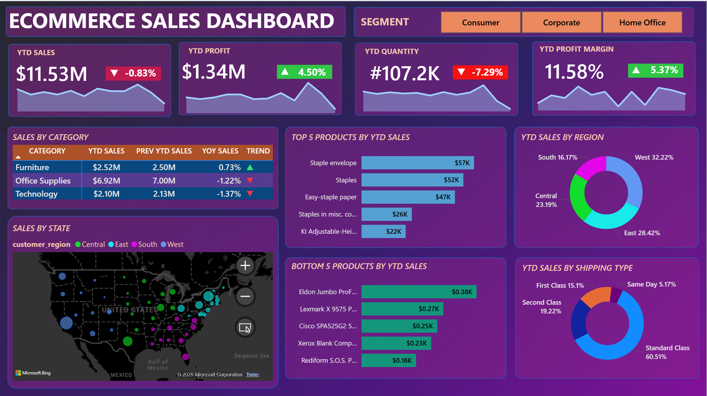

🛒 E-Commerce Sales Dashboard | Power BI

 📌 Project Overview
This project is an interactive E-Commerce Sales Dashboard built using Power BI.

The dashboard provides insights into sales performance, profitability, product trends, and regional distribution, helping businesses make data-driven decisions.

---

 🎯 Business Objectives
- Track overall sales and profit performance (YTD)
- Analyze category-wise sales trends
- Identify top and bottom performing products
- Understand regional sales distribution
- Monitor shipping mode performance

---

 🛠 Tools & Technologies Used
- Power BI Desktop
- DAX (Data Analysis Expressions)
- Power Query
- Data Modeling

---

 📊 Key Insights
- Total YTD Sales: **$11.53M**
- Total YTD Profit: **$1.34M**
- Profit Margin: **11.58%**
- Highest Sales Category: **Office Supplies**
- Top Region: **West (32.22%)**
- Most Used Shipping Mode: **Standard Class (60.51%)**

---

 📸 Dashboard Preview

---

 🚀 Features
- KPI Cards with trend indicators
- Category-wise sales comparison
- Top 5 & Bottom 5 product analysis
- Region-wise and state-wise sales visualization
- Shipping type performance breakdown
- Interactive filters (Segment)
